# Project Description

## 1. Project Overview

- **Project Name:** Animal Escape — Maze Survival

- **Brief Description:**
  Animal Escape is a 2D top-down maze survival game developed in Python using the Pygame library. The player selects one of three animal characters and must navigate a procedurally-designed maze while being hunted by an AI-controlled wolf. The goal is to survive as long as possible, collect power-up items, and accumulate a high score.

  The game features real-time keyboard controls, A*-based enemy pathfinding, six types of collectible items, environmental hazards (water traps), and a full statistics system that records gameplay data to a CSV file and visualizes it in a separate Tkinter window.

- **Problem Statement:**
  Most maze games lack depth in both enemy AI and gameplay analytics. This project addresses that by combining meaningful survival mechanics with a data-logging system that lets players analyze their own behavior and performance across multiple sessions.

- **Target Users:**
  Casual gamers and students interested in game development, Python OOP design, and basic data visualization.

- **Key Features:**
  - 3 playable characters with distinct stats (HP, Mana, bonuses)
  - A*-based wolf AI that intelligently chases the player through the maze
  - 6 item types: Heal, Shield, Clock (speed), Wall (phase), Trap, Star (score)
  - Dynamic difficulty — wolf speed scales with player score
  - Water trap hazards that slow and damage the player
  - Pause menu and game-over screen with Retry / Main Menu / Exit options
  - CSV-based statistics logging (position, damage, item collection, survival time)
  - Tkinter statistics viewer with 5 graphs and a summary table

- **Screenshots:** *(see `/screenshots/` folder in repository)*
  **Example**
  **Gameplay**
  | Main Menu | Character Selection | In-Game Maze |
  |---|---|---|
  | 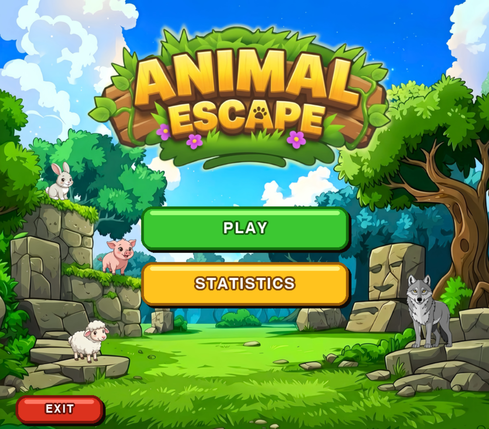 | 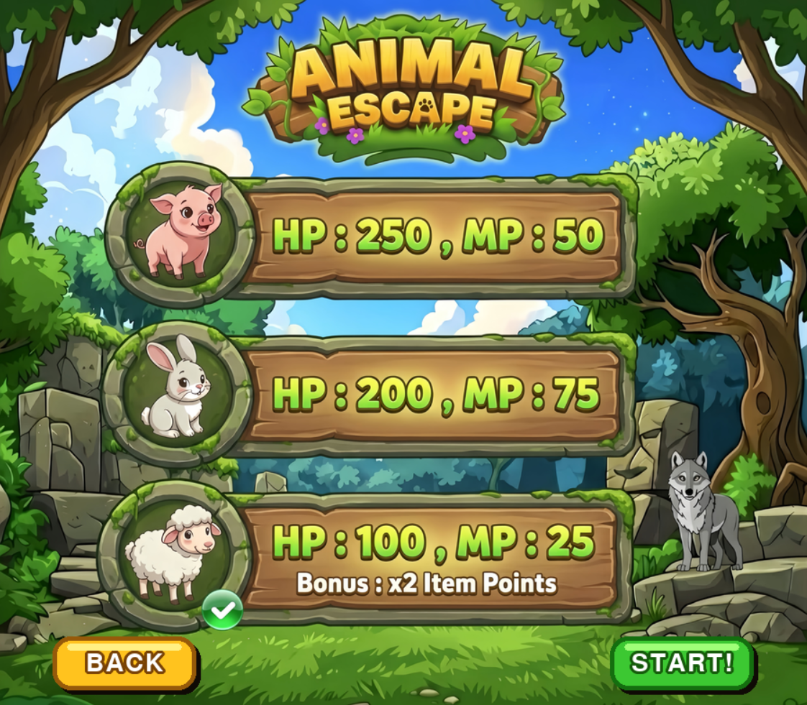 | 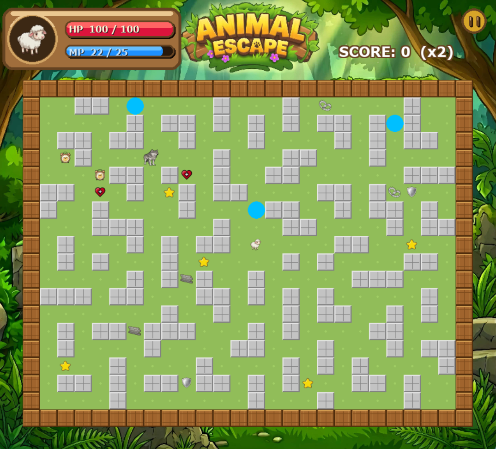 |

  | Pause Menu | Game Over |
  |---|---|
  | 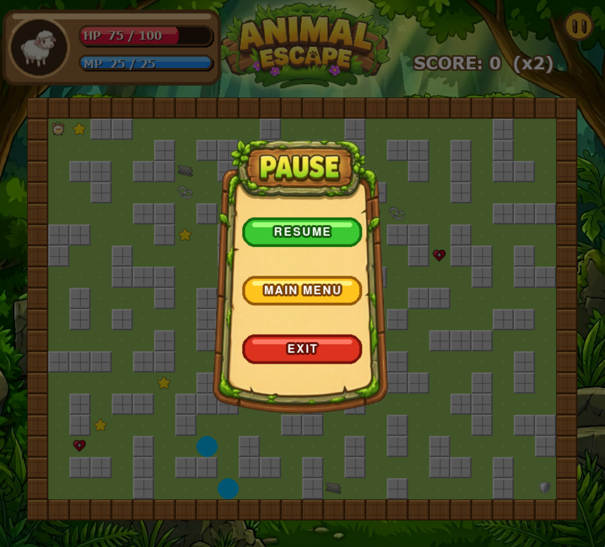 | 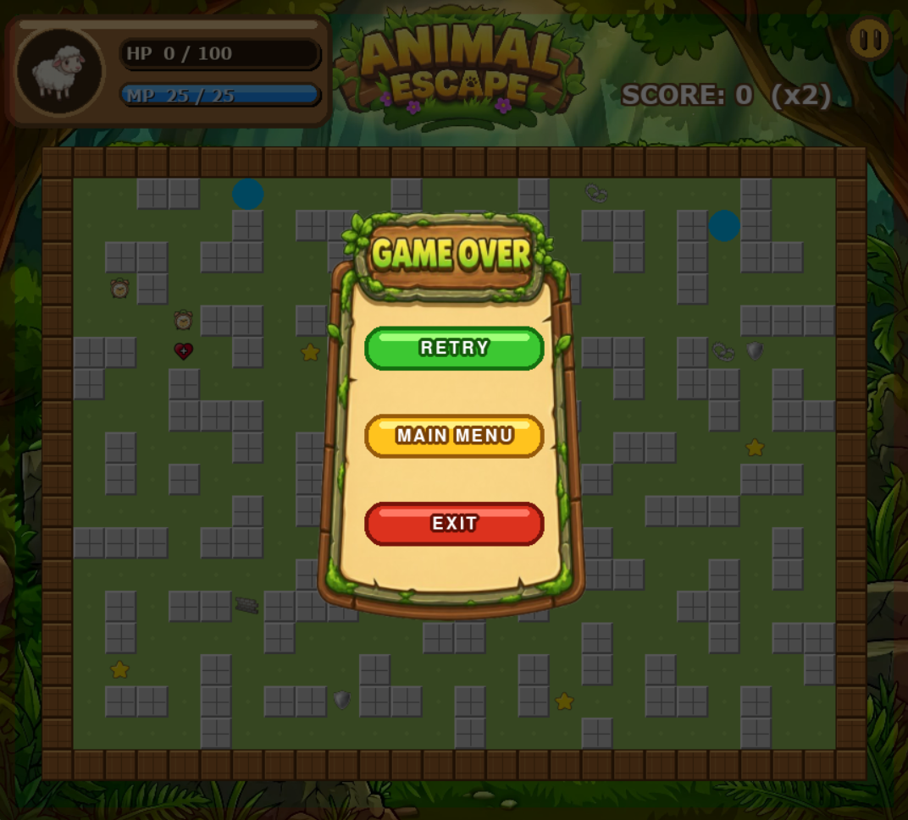 |

  **Statistics Viewer**
  | All Graphs Overview | Summary Stats Table |
  |---|---|
  | 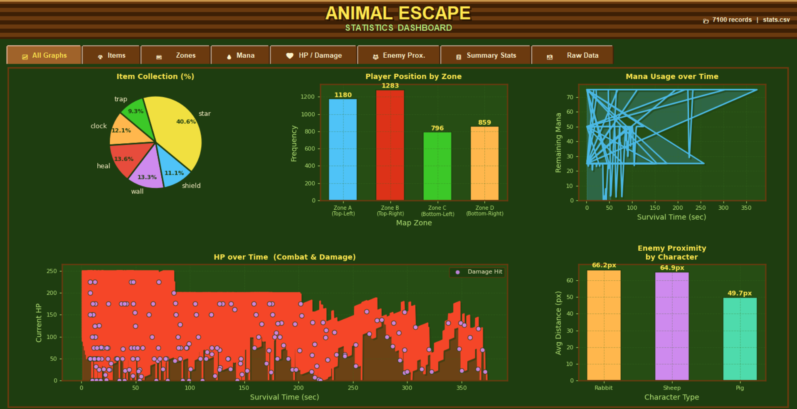 | 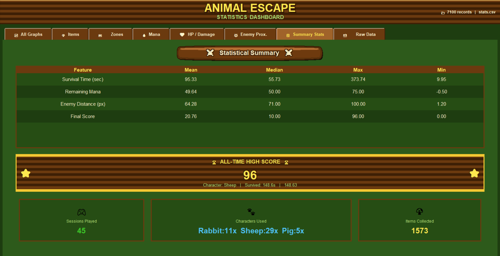 |

  | Item Collection | Position Zone | Mana Usage | HP Over Time | Enemy Proximity |
  |---|---|---|---|---|
  | 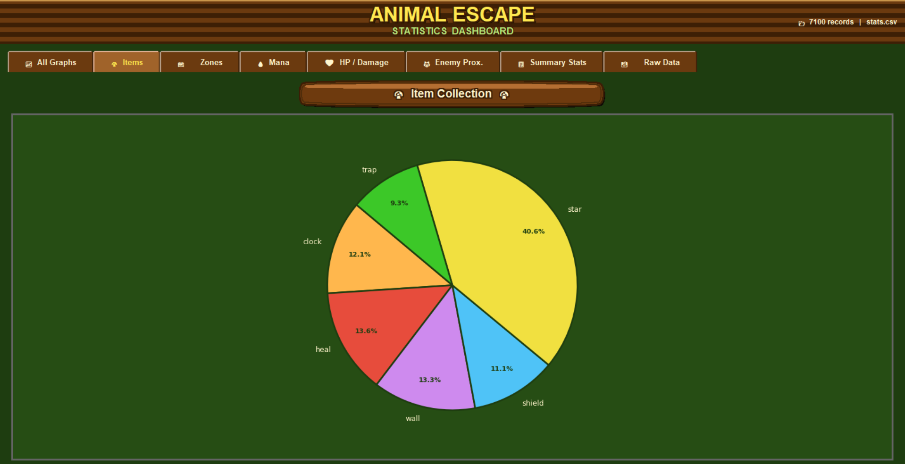 | 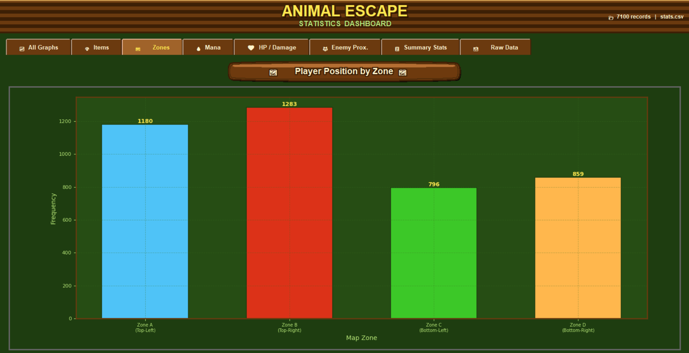 | 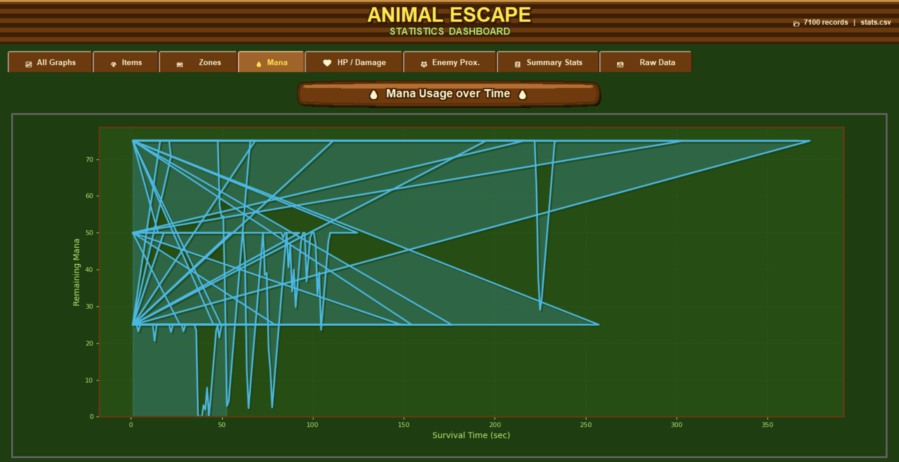 | 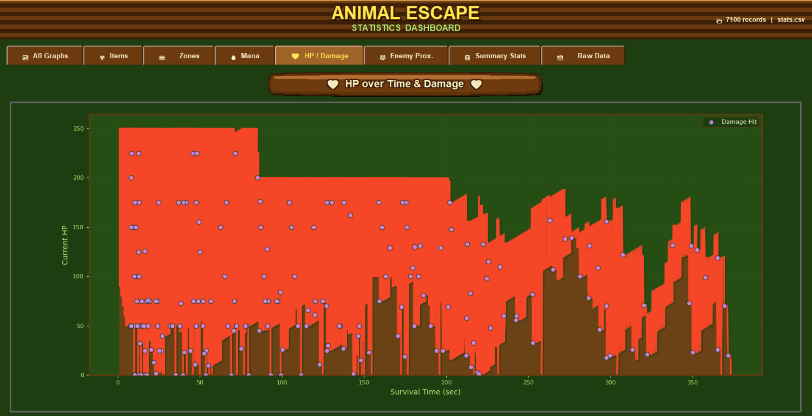 | 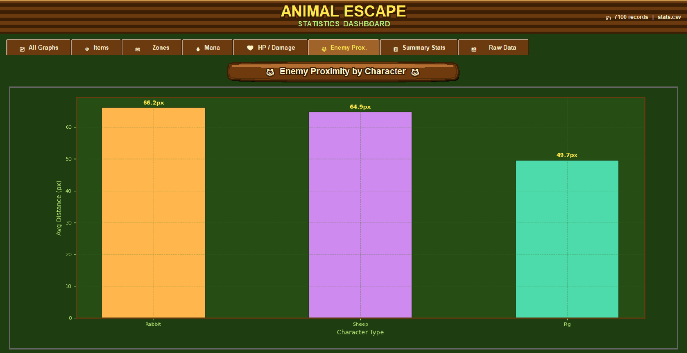 |


- **Proposal:** [proposal](proposal.pdf)

- **YouTube Presentation:** [Link here — replace with your video URL]
  - (1) Demo of all game and statistics features
  - (2) Explanation of class design and OOP usage
  - (3) Explanation of statistics and data visualization

---

## 2. Concept

### 2.1 Background

This project was inspired by classic maze-chase games such as Pac-Man, where the core tension comes from navigating a confined space while being pursued. We modernized the concept by:

- Adding a variety of items that create meaningful player decisions
- Using A* pathfinding instead of random ghost movement, making the AI feel more realistic
- Including a statistics system that adds a "meta-game" layer where players can review their own performance data

The maze survival genre is compelling because it creates urgency and forces spatial reasoning. Combining it with data analytics is a natural extension for a programming course project.

### 2.2 Objectives

- Design and implement a fully playable maze survival game using Python and Pygame
- Apply OOP principles: encapsulation, inheritance, and polymorphism across all game classes
- Implement A* pathfinding for enemy AI navigation
- Log structured gameplay data (events, position, HP, mana, score) to a CSV file each session
- Visualize collected data with Matplotlib charts (pie, bar, line, area) inside a Tkinter GUI
- Produce a clean, documented codebase that can be reproduced and extended

---

## 3. UML Class Diagram

The UML class diagram shows all classes, their attributes, methods, and relationships (inheritance and association).

**Attachment:** [UML.pdf](./UML.pdf)

### Class Overview

```
Player ──────────────────────── uses ──► MapManager (Game)
  │                                          │
  └─ uses items ──► Item (base)              ├── Wolf
                       │                     ├── StatsLogger
                       ├── HealItem          └── PlacedTrap / WaterTrap
                       ├── ShieldItem
                       ├── ClockItem
                       ├── WallItem
                       ├── StarItem
                       └── TrapItem
```

---

## 4. Object-Oriented Programming Implementation

- **`Player`** — Represents the player character. Manages HP, mana, movement, collision with walls, item usage, timers (invulnerability, speed boost, wall phase), and score. Loaded from a character data dictionary.

- **`Wolf`** — The enemy AI. Uses A* pathfinding each frame to navigate toward the player. Handles attack logic, stun timer, slow timer, and directional sprite flipping.

- **`Item` (base class)** — Abstract base for all collectible items. Handles sprite loading, position, active state, and respawn timer logic.
  - **`HealItem`** — Restores 20 HP on collection.
  - **`ShieldItem`** — Grants the player one damage-blocking shield.
  - **`ClockItem`** — Activates a 2-second speed boost.
  - **`WallItem`** — Allows wall-phasing for 1 second.
  - **`StarItem`** — Awards +1 score (doubled for the Sheep character).
  - **`TrapItem`** — Places a `PlacedTrap` object on the map that slows the wolf.

- **`PlacedTrap`** — A temporary trap object placed by the player. Removed when the wolf steps on it or when its timer expires.

- **`WaterTrap`** — An environmental hazard drawn as a circle. Slows and damages the player on contact.

- **`Game` (in `map_manager.py`)** — The main game engine. Manages the game loop, maze grid data, rendering (world, UI, pause menu, game-over screen), item/trap spawning, wolf scaling, and collision resolution.

- **`StatsLogger`** — Handles all data recording. Buffers log rows in memory and writes them to `stats.csv` at game over. Logs events: `item_collect`, `damage`, `position`, `enemy_proximity`, `game_over`.

---

## 5. Statistical Data

### 5.1 Data Recording Method

Data is recorded every game session via the `StatsLogger` class and written to a local CSV file (`stats.csv`) using Python's built-in `csv` module. Logging is event-driven:

- **Every frame** (`auto_record`): Logs a `position` row approximately once per second (every 60 frames). Logs an additional `enemy_proximity` row when the wolf is within 100 px.
- **On item collection** (`log_item_collect`): Logs which item was collected, plus the full game state at that moment.
- **On damage** (`log_damage`): Logs the game state immediately after the player takes a hit.
- **On game over** (`log_game_over`): Logs the final state and flushes the entire buffer to disk.

### 5.2 Data Features

The CSV file contains the following columns:

| Column | Description |
|---|---|
| `timestamp` | Time in seconds since the session started |
| `event` | Event type: `position`, `item_collect`, `damage`, `enemy_proximity`, `game_over` |
| `char_type` | Character selected (Pig / Rabbit / Sheep) |
| `score` | Player score at the time of the event |
| `hp` | Current HP |
| `mana` | Current mana |
| `player_x` | Player X position in pixels |
| `player_y` | Player Y position in pixels |
| `enemy_x` | Wolf X position in pixels |
| `enemy_y` | Wolf Y position in pixels |
| `enemy_dist` | Euclidean distance between player and wolf |
| `item_type` | Item type collected (empty if not an item event) |
| `survival_time` | Total seconds survived in the session |

**Visualizations produced from this data:**
1. **Item Collection Pie Chart** — Distribution of item types collected
2. **Player Position Zone Bar Chart** — Where on the map the player spends the most time
3. **Mana Usage Line Graph** — Mana level over survival time
4. **HP over Time Area Chart** — HP trend with damage events highlighted
5. **Enemy Proximity Bar Chart** — Average wolf distance per character type
6. **Summary Statistics Table** — Mean, Median, Max, Min for key metrics

---

## 6. Changed Proposed Features

The following features were listed in the original proposal but were **not implemented** in the final version of the project. Each change is explained below.

| Proposed Feature | What Was Actually Done | Reason |
|---|---|---|
| **Predictive AI** — Enemy predicts the player's future position 2–3 seconds ahead using velocity to cut off movement | Standard **A\* pathfinding** only — the wolf navigates toward the player's *current* position with no prediction | Predictive AI added complexity that conflicted with the maze grid structure. A\* alone provides sufficiently challenging pursuit behavior within the maze environment. |
| **`patrol()` method** — Wolf roams a predefined path when the player is out of range | Not implemented — the wolf always actively chases the player via A\* regardless of distance | A patrol state was not necessary for gameplay balance; continuous A\* pursuit created enough tension without idle roaming behavior. |
| **Low HP screen flash effect** — A red flashing overlay appears when the player's HP drops below 50 | Not implemented — there is no screen flash effect in the final code | This visual effect was deprioritized during development. The HP bar already communicates low health clearly enough for the current scope. |
| **Difficulty scaling: spawn rate increases every 10 points** | Only **wolf speed** increases every 10 points — item/trap spawn rate remains constant | Dynamically adjusting spawn rate introduced balancing issues during testing. Wolf speed scaling alone was sufficient to increase difficulty progressively. |